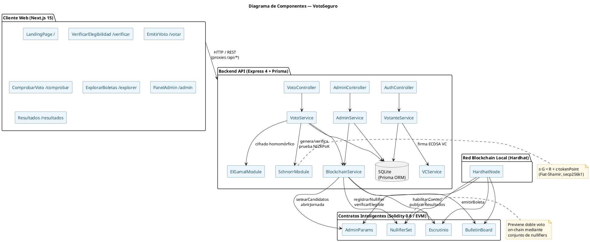
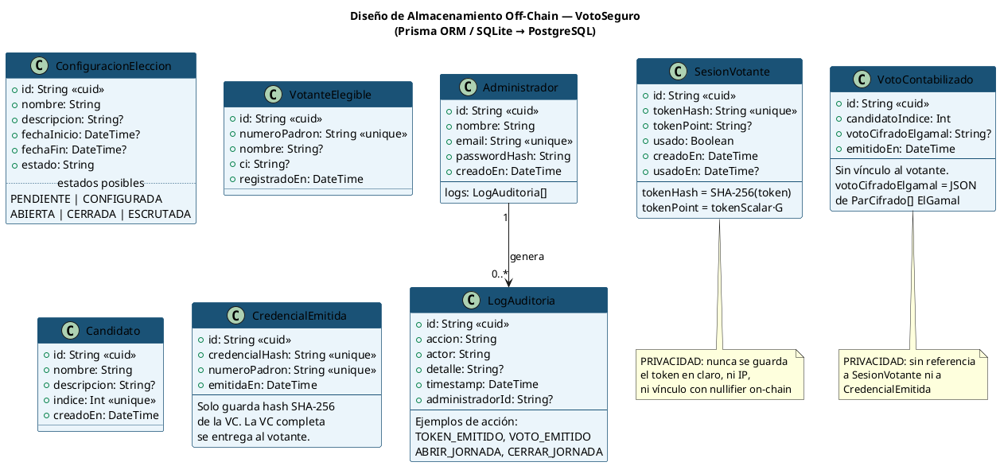
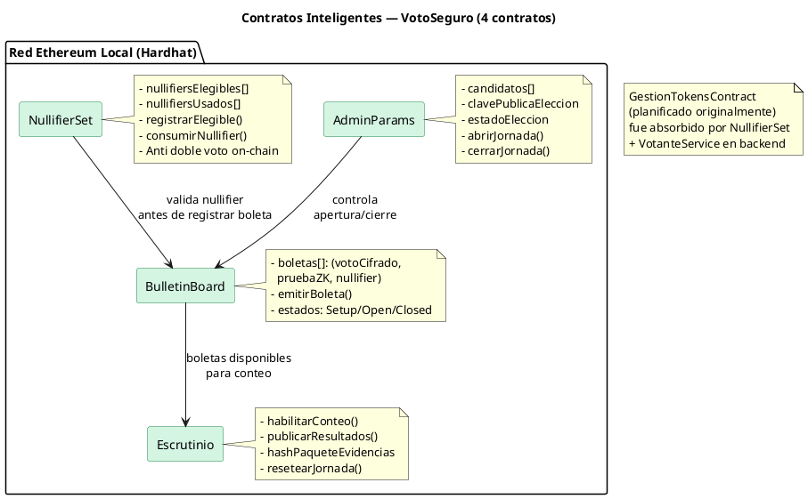

# Guía de correcciones manuales — T2_DiegoMoron
> Sigue este documento de arriba hacia abajo. Cada ítem indica **dónde** y **qué** pegar o cambiar.

---

## PARTE A — TEXTO QUE DEBES PEGAR (secciones nuevas)

---

### A1. RESUMEN
**Dónde:** Página nueva antes de "Marco Referencial" (después de la carátula/índice).  
**Estilo:** Heading 1 para el título, párrafo normal para el cuerpo.

---

**RESUMEN**

El presente trabajo de grado propone y desarrolla VotoSeguro, un prototipo de sistema de votación electrónica descentralizado y verificable, diseñado para contextos donde la confianza institucional en los procesos electorales es limitada. El problema de investigación surge de la crisis de credibilidad electoral boliviana de 2019, donde la percepción de irregularidades en la transmisión y conteo de resultados evidenció la necesidad de mecanismos técnicos de verificación independiente.

El sistema integra tres tecnologías criptográficas reales: credenciales verificables W3C firmadas con ECDSA para la autenticación de elegibilidad sin revelar identidad; pruebas de conocimiento cero no interactivas basadas en el protocolo de Schnorr con transformación de Fiat-Shamir (NIZKPoK) para la validación anónima de boletas; y contratos inteligentes Solidity sobre red Ethereum local para el registro inmutable de votos y la prevención de doble voto mediante nullifiers on-chain.

El prototipo fue desarrollado como monorepo sobre Scaffold-ETH 2 mediante metodología Scrum adaptada en siete sprints, integrando cuatro paquetes: contratos Solidity (AdminParams, NullifierSet, BulletinBoard, Escrutinio), API REST en Express con Prisma ORM, frontend en Next.js 15 con React 19, y biblioteca de utilidades criptográficas. La suite de pruebas automatizadas cubre más de 78 casos de prueba unitarios, de integración, de contrato y de regresión, todos ejecutados con resultado satisfactorio.

Los resultados demuestran que es técnicamente viable implementar verificabilidad extremo a extremo en un entorno académico controlado sin comprometer el secreto del sufragio. El prototipo constituye una base reproducible y auditable para futuras investigaciones en sistemas electorales con garantías criptográficas formales.

**Palabras clave:** votación electrónica, blockchain, pruebas de conocimiento cero, Schnorr, credenciales verificables, contratos inteligentes, verificabilidad E2E, anonimato del voto.

---

### A2. JUSTIFICACIÓN ECONÓMICA (sección 1.7.3)
**Dónde:** Después de la "Justificación Social" (sección 1.7.2), antes de "Límites y alcances".  
**Estilo:** mismo formato de las otras justificaciones.

---

**Justificación económica**

Este proyecto se justifica económicamente porque demuestra que una solución de verificabilidad electoral puede construirse utilizando exclusivamente herramientas de código abierto, sin licencias comerciales ni infraestructura propietaria. El costo operativo del prototipo en entorno de laboratorio es prácticamente nulo: funciona sobre hardware universitario existente y redes locales sin costo adicional.

Extrapolando a una implementación real, el modelo de contratos inteligentes sobre blockchain elimina la necesidad de infraestructura centralizada de alta disponibilidad, cuyo costo en soluciones convencionales puede superar los cientos de miles de dólares anuales para una elección de escala nacional (Unión Interparlamentaria, 2022). La naturaleza reproducible del sistema también reduce los costos de auditoría externa: cualquier tercero puede verificar el conteo de manera independiente sin contratar servicios especializados, representando un ahorro significativo respecto a los modelos que dependen de empresas privadas para la transmisión y certificación de resultados.

---

### A3. SECCIÓN 3.3.2 — EJECUCIÓN DE ETAPAS DE LA METODOLOGÍA
**Dónde:** Antes de "Historias de Usuario" (sección 3.3.3), dentro del bloque 3.3 Análisis del proyecto.  
**Estilo:** mismo formato de las subsecciones del Marco Práctico.

---

**3.3.2. Ejecución de etapas de la metodología**

El desarrollo del sistema siguió una metodología Scrum adaptada, organizada en siete sprints de duración variable entre una y dos semanas, con revisión de entregables al cierre de cada iteración.

El **Sprint 0** configuró el monorepo base (Scaffold-ETH 2, Prisma, cadena Hardhat local) y definió el backlog inicial. El **Sprint 1** implementó el módulo de identidad: verificación de elegibilidad vía credenciales verificables W3C y emisión del token anónimo con registro de su hash en base de datos. El **Sprint 2** desarrolló la emisión de votos y el registro on-chain con los cuatro contratos inteligentes desplegados en la red local. El **Sprint 3** completó la verificación individual, permitiendo al votante consultar su comprobante mediante txHash desde la página `/comprobar`.

El **Sprint 4** incorporó el panel de administración (`/admin`) para apertura y cierre de la jornada electoral mediante llamadas autenticadas a los contratos. El **Sprint 5** implementó el escrutinio cooperativo con Shamir Secret Sharing y la publicación de resultados en `/resultados`. El **Sprint 6** integró la criptografía real: pruebas Schnorr-Fiat-Shamir sobre secp256k1, cifrado ElGamal homomórfico y firmas ECDSA reales en credenciales VC. El **Sprint 7** se dedicó al endurecimiento de la suite de pruebas, la prueba de usabilidad con voluntarios y la generación del paquete de evidencias reproducible.

Cada sprint cerró con la ejecución completa de la suite de regresión y la actualización de la matriz de trazabilidad en `docs/testing/MATRIZ_REGRESION.md`.

---

### A4. SECCIÓN 3.7 — ANÁLISIS DE COSTOS
**Dónde:** Antes de la sección actualmente titulada "3.7. Propuesta de solución" (que debes renombrar a "3.8. Desarrollo del prototipo", ver sección B).  
**Estilo:** mismo formato del Marco Práctico.

---

**3.7. Análisis de costos**

El análisis de costos distingue entre los recursos utilizados durante la fase de investigación y desarrollo, y los costos estimados para una hipotética implementación a mayor escala.

**Costos de desarrollo**

El prototipo fue construido utilizando exclusivamente herramientas de código abierto sin costo de licencia: Next.js, Hardhat, Prisma, @noble/curves, Vitest y Playwright. El hardware utilizado corresponde a equipos propios y de laboratorio universitario ya disponibles. El principal costo de desarrollo es el tiempo del investigador, estimado en aproximadamente 560 horas distribuidas a lo largo de los 7 sprints del proyecto.

| Recurso | Cantidad | Costo unitario | Total estimado |
|---|---|---|---|
| Tiempo del investigador | 560 h | Bs. 50/h | Bs. 28.000 |
| Uso proporcional de hardware | — | — | Bs. 800 |
| Conexión a internet | 4 meses | Bs. 100/mes | Bs. 400 |
| Licencias de software | — | Bs. 0 (código abierto) | Bs. 0 |
| **Total** | | | **Bs. 29.200** |

*Equivalente aproximado: USD 4.200 al tipo de cambio vigente (Bs. 6,96/USD).*

**Costos de infraestructura para el piloto universitario**

Para la ejecución del piloto, toda la infraestructura opera localmente sobre la red interna de la universidad, sin requerir servidores externos ni conectividad a redes blockchain públicas. El costo de infraestructura adicional es cero.

**Comparación con soluciones comerciales**

Los sistemas de votación electrónica convencionales requieren contratos de licencia con proveedores privados cuyo costo oscila entre USD 50.000 y USD 500.000 para una elección de escala nacional (Unión Interparlamentaria, 2022). El modelo propuesto, basado en código abierto y contratos inteligentes en red distribuida, elimina los costos de licencia y de infraestructura centralizada, trasladando la carga de verificación a la red blockchain y permitiendo auditoría independiente sin costos adicionales.

---

### A5. CAPÍTULO 4 — CONCLUSIONES Y RECOMENDACIONES
**Dónde:** Página nueva después del Cronograma (al final del documento, antes de Referencias bibliográficas).

---

**Capítulo 4. Conclusiones y Recomendaciones**

**4.1 Conclusiones**

El desarrollo del prototipo VotoSeguro demuestra que es técnicamente viable construir un sistema de votación electrónica con verificabilidad extremo a extremo en un entorno académico, combinando tecnologías criptográficas formalmente fundadas. Las siguientes conclusiones se derivan del trabajo realizado:

1. La separación entre elegibilidad y emisión, implementada mediante credenciales verificables W3C con firma ECDSA y tokens anónimos de un solo uso, garantiza que ninguna entidad del sistema pueda vincular la identidad del votante con su voto, cumpliendo el requisito de secreto del sufragio establecido en el objetivo general.

2. Las pruebas de conocimiento cero no interactivas (NIZKPoK) basadas en el protocolo de Schnorr con transformación de Fiat-Shamir proveen una garantía criptográfica formal de que el votante posee el secreto correspondiente a su token sin revelar información adicional. Esta propiedad es verificable de forma independiente por cualquier auditor con acceso al código fuente publicado.

3. El registro inmutable en contratos inteligentes Solidity, combinado con el mecanismo de nullifiers en NullifierSet, previene el doble voto sin almacenar datos que vinculen identidades con preferencias electorales, cumpliendo simultáneamente los requisitos de unicidad y privacidad.

4. La arquitectura monorepo sobre Scaffold-ETH 2 con cuatro contratos inteligentes (AdminParams, NullifierSet, BulletinBoard, Escrutinio) demostró ser adecuada para el prototipo académico: permite reproducibilidad completa del entorno con comandos documentados y facilita la integración entre las capas on-chain y off-chain.

5. La suite de pruebas automatizadas, con más de 78 casos distribuidos en pruebas unitarias, de integración, de contrato Solidity y de regresión, proporciona la evidencia técnica necesaria para demostrar la corrección de las reglas de negocio implementadas y la ausencia de regresiones entre sprints.

6. El objetivo general fue alcanzado: el prototipo permite emitir, registrar y publicar evidencias para verificación individual del voto, con garantías criptográficas reales que van más allá de una demostración visual, constituyendo un sistema verificable y reproducible por terceros.

**4.2 Recomendaciones**

Del análisis del trabajo realizado surgen las siguientes recomendaciones para proyectos que continúen esta línea de investigación:

1. Migrar el motor de base de datos de SQLite a PostgreSQL para entornos de producción o pilotos con concurrencia real, aprovechando la abstracción de Prisma ORM que hace esta migración transparente mediante el cambio de una variable de entorno.

2. Implementar los circuitos criptográficos en Noir/Barretenberg para pruebas ZK más complejas (compromiso de Merkle, nullifier set completamente on-chain) que requieran verificación en el contrato inteligente, como paso siguiente natural al prototipo actual basado en Schnorr.

3. Extender el esquema de credenciales verificables W3C para incluir atributos de zona electoral y período de habilitación, permitiendo modelar elecciones con múltiples circunscripciones y períodos diferenciados.

4. Realizar el piloto de usabilidad con una muestra mínima de 30 participantes representativos del electorado objetivo, para obtener datos estadísticamente significativos sobre eficiencia, eficacia y satisfacción.

5. Evaluar la integración con redes blockchain públicas de prueba (Sepolia, Amoy) para medir los costos reales de gas de las operaciones críticas y determinar la viabilidad económica de una implementación de mayor escala.

6. Formalizar el protocolo de escrutinio cooperativo con Shamir Secret Sharing mediante un documento de seguridad público que especifique el umbral mínimo de participantes, el procedimiento de reconstrucción de clave y los mecanismos de detección de participantes deshonestos.

---

## PARTE B — TEXTO QUE DEBES MODIFICAR (reemplazos)

---

### B1. Herramienta "Noir y NoirJS" — Sección 1.9 Herramientas
**Dónde:** Busca el subtítulo "Noir y NoirJS (Pruebas de conocimiento cero)" y los dos párrafos que le siguen.  
**Reemplaza EXACTAMENTE esto:**

> Noir y NoirJS (Pruebas de conocimiento cero)
>
> "Noir es un lenguaje de programación diseñado específicamente para construir circuitos criptográficos destinados a pruebas de conocimiento cero (ZKP) de forma más legible, modular y segura que lenguajes previos basados únicamente en constraints matemáticas. NoirJS es su biblioteca complementaria para JavaScript, que permite compilar circuitos, generar pruebas y verificarlas directamente desde aplicaciones web o scripts."
>
> En el proyecto, Noir y NoirJS serán utilizados para la validación criptográfica de boletas, permitiendo demostrar que un votante emitió una boleta válida sin revelar su identidad ni el contenido del voto.

**Por esto:**

> Protocolo Schnorr-Fiat-Shamir (Pruebas de conocimiento cero)
>
> "El protocolo de Schnorr, adaptado a la forma no interactiva mediante la transformación de Fiat-Shamir, es un esquema criptográfico que permite generar pruebas de conocimiento cero no interactivas (NIZKPoK) para la relación de logaritmo discreto. Propuesto originalmente por Schnorr en 1991, y adaptado por Fiat y Shamir en 1986, esta construcción opera en el modelo del oráculo aleatorio y ha sido ampliamente analizada en la literatura criptográfica" (Schnorr, 1991; Fiat & Shamir, 1986).
>
> En el proyecto, este protocolo se implementó en el módulo `schnorr.ts` sobre la curva secp256k1 usando la biblioteca @noble/curves. Se utiliza para que el votante demuestre poseer el secreto correspondiente a su token de voto antes de emitir la boleta, sin revelar el token en claro. La prueba generada (R, s) se incluye en cada solicitud de emisión y es verificada por el backend mediante la ecuación s·G = R + c·tokenPoint, donde c = H(R ∥ tokenPoint ∥ mensaje) es el reto Fiat-Shamir.

---

### B2. Párrafo ZKP en Marco Teórico — Sección "Garantía de secreto y verificabilidad"
**Dónde:** Busca el párrafo que empieza con "La garantía del secreto recae en los métodos de cifrado a la hora de emitir el voto ya que se utilizará ZK Proof..."

**Reemplaza por:**

> La garantía del secreto recae en los métodos de cifrado a la hora de emitir el voto. Para la validación criptográfica de boletas se implementó una prueba de conocimiento cero no interactiva (NIZKPoK) basada en el protocolo de Schnorr-Fiat-Shamir, la cual permite demostrar que el votante posee el secreto correspondiente a su token de voto sin revelar el token en claro ni su preferencia electoral. Gracias a esto, el voto se mantiene cifrado e inalterable dentro de la red y los ciudadanos pueden comprobar que su voto fue incluido sin revelar información adicional (Schnorr, 1991).

---

### B3. Párrafo ZKProofGenerator en Diagrama de Código (Segmento 3 — Módulo Criptográfico)
**Dónde:** Busca el párrafo que empieza con "ZKProofGenerator implementa los circuitos en Noir para generar y verificar..."

**Reemplaza por:**

> ZKProofGenerator implementa el protocolo de Schnorr-Fiat-Shamir para generar y verificar pruebas de conocimiento cero no interactivas (NIZKPoK) sobre la curva secp256k1. Cuando un votante emite su boleta, este módulo genera una prueba (R, s) que demuestra conocimiento del escalar secreto correspondiente al tokenPoint registrado, sin revelar el token en claro. La verificación sigue la ecuación s·G = R + c·tokenPoint, donde c = H(R ∥ tokenPoint ∥ mensaje) es el reto Fiat-Shamir (Schnorr, 1991).

---

### B4. Párrafo "cinco contratos" en Segmento 4 — Contratos Inteligentes
**Dónde:** Busca el párrafo que empieza con "El segmento de Contratos Inteligentes modela los **cinco** contratos Solidity..."

**Reemplaza solo la primera oración** (el resto del párrafo se mantiene):

> El segmento de Contratos Inteligentes modela los **cuatro** contratos Solidity desplegados en la red blockchain, que forman la capa de confianza inmutable del sistema. La funcionalidad de gestión de tokens, planificada inicialmente como un quinto contrato independiente (GestionTokensContract), fue integrada como lógica de servicio en el backend (VotanteService) combinada con NullifierSet para la verificación on-chain, optimizando el número de transacciones necesarias por operación. AdminParamsContract es el contrato de gobernanza de la elección: almacena el estado de la jornada, las fechas de apertura y cierre, el catálogo de candidatos y la clave pública de cifrado...

*(continúa igual que antes)*

---

### B5. Nota SQLite en sección 3.5 Base de datos
**Dónde:** Al final de la sección "Diseño de Almacenamiento de datos", justo antes del heading "3.6 Validación y pruebas del sistema". Agrega el siguiente párrafo:

> **Nota sobre motor de base de datos:** Durante el desarrollo del prototipo se utilizó SQLite como motor de base de datos relacional, en lugar del PostgreSQL contemplado en la planificación inicial. Esta decisión responde a que SQLite no requiere instalación de servidor, simplifica la configuración del entorno de laboratorio y es suficiente para el volumen de datos de un piloto controlado. La migración a PostgreSQL es transparente mediante Prisma ORM: el único cambio necesario es reemplazar `provider = "sqlite"` por `provider = "postgresql"` en `schema.prisma` y actualizar la variable de entorno `DATABASE_URL`.

---

### B6. Tabla HU-07 — celda COMO/QUIERO
**Dónde:** Tabla HU7 (módulo Resultados). Busca la celda que dice:  
> "COMO: Votante habilitado / QUIERO/NECESITO: acceder al sistema usando mi token de autenticación"

**Reemplaza el contenido de esa celda por:**

> COMO: Ciudadano interesado  
> QUIERO/NECESITO: consultar los resultados publicados de la elección en la plataforma web  
> PARA: verificar que el conteo fue realizado correctamente y que el resultado publicado es auténtico e inalterable

---

### B7. Renombraciones de secciones
| Texto actual | Reemplazar por |
|---|---|
| `3.7. Propuesta de solución` | `3.8. Desarrollo del prototipo` |
| `3.8. Maquetado` | `3.8.1. Maquetado del sistema implementado` |

---

### B8. Referencias bibliográficas — agregar al final de tu Bibliografía
Agrega estas dos referencias en formato APA:

```
Fiat, A., & Shamir, A. (1986). How to prove yourself: Practical solutions to
  identification and signature problems. En A. M. Odlyzko (Ed.), Advances in
  Cryptology – CRYPTO '86. Lecture Notes in Computer Science, vol 263
  (pp. 186–194). Springer. https://doi.org/10.1007/3-540-47721-7_12

Schnorr, C. P. (1991). Efficient signature generation by smart cards.
  Journal of Cryptology, 4(3), 161–174.
  https://doi.org/10.1007/BF00196725
```

---

## PARTE C — DIAGRAMAS PLANTUML (reemplazar figuras existentes)

---

### C1. Figura 35 — Diagrama de Componentes (4 contratos, no 5)
Genera la imagen desde este código PlantUML y reemplaza la Figura 35 actual:



---

### C2. Figura 41 — Diseño de Datos Auxiliares (BD Off-chain actualizada)
Genera la imagen y reemplaza la Figura 41:



---

### C3. Figura 35b — Diagrama de Componentes nivel Contratos (detalle)
Si tienes un diagrama separado solo de contratos, reemplázalo con este:



---

## PARTE D — QUÉ NO NECESITA CAMBIOS EN EL CÓDIGO

El código está alineado. Verificado:
- `packages/hardhat/contracts/` → 4 contratos correctos
- `packages/backend/src/lib/schnorr.ts` → Schnorr real sobre secp256k1
- `packages/backend/prisma/schema.prisma` → SQLite con todos los modelos (incluye CredencialEmitida, VotanteElegible, Candidato, VotoContabilizado)
- Rutas frontend: `/verificar`, `/votar`, `/comprobar`, `/explorer`, `/admin`, `/resultados` → todas implementadas
- `packages/backend/src/routes/adminRoutes.ts` → panel completo con Shamir

**No toques nada del código antes de la defensa.**

---

## RESUMEN EJECUTIVO

| # | Tarea | Tipo | Tiempo est. |
|---|---|---|---|
| A1 | Pegar Resumen | Copiar/pegar | 5 min |
| A2 | Pegar Justificación Económica | Copiar/pegar | 5 min |
| A3 | Pegar sección 3.3.2 Etapas | Copiar/pegar | 5 min |
| A4 | Pegar sección 3.7 Análisis de costos | Copiar/pegar + tabla | 10 min |
| A5 | Pegar Capítulo 4 completo | Copiar/pegar | 10 min |
| B1 | Reemplazar herramienta Noir→Schnorr | Buscar/reemplazar | 5 min |
| B2 | Reemplazar párrafo ZKP Marco Teórico | Buscar/reemplazar | 3 min |
| B3 | Reemplazar párrafo ZKProofGenerator | Buscar/reemplazar | 3 min |
| B4 | Reemplazar "cinco contratos" | Buscar/reemplazar | 3 min |
| B5 | Agregar nota SQLite | Insertar párrafo | 3 min |
| B6 | Corregir tabla HU-07 | Editar celda | 3 min |
| B7 | Renombrar secciones 3.7 y 3.8 | Buscar/reemplazar | 2 min |
| B8 | Agregar referencias APA (Schnorr, Fiat) | Copiar/pegar | 2 min |
| C1 | Generar y pegar Figura 35 (componentes) | PlantUML → imagen | 10 min |
| C2 | Generar y pegar Figura 41 (BD off-chain) | PlantUML → imagen | 10 min |
| C3 | Generar y pegar detalle contratos | PlantUML → imagen | 5 min |

**Total estimado: ~85 minutos**

Para generar imágenes desde PlantUML: https://www.plantuml.com/plantuml/uml/
